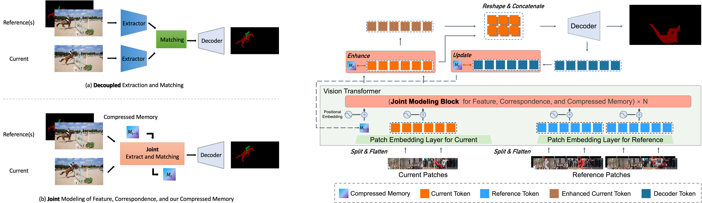
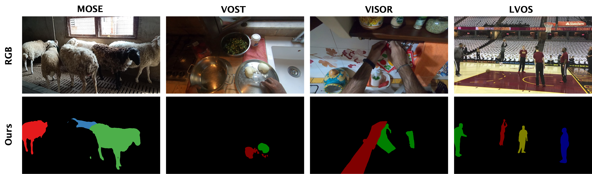

# JointFormer

The official PyTorch implementation of our paper:

**[TPAMI 2025] JointFormer: A Unified Framework with Joint Modeling for Video Object Segmentation**

Authors: [Jiaming Zhang](https://github.com/z-jiaming/), [Yutao Cui](https://github.com/yutaocui), Gangshan Wu, [Limin Wang](https://wanglimin.github.io/)

Paper: [arxiv](https://arxiv.org/abs/2308.13505), [IEEE](https://ieeexplore.ieee.org/document/10949703)

## Overview

A **unified** VOS framework for **joint modeling** the three elements of feature, correspondence, and our presented compressed memory.



## Quick Start

- See [INSTALL.md](./docs/INSTALL.md) for instructions of installing required python packages.
- See [DATASET.md](./docs/DATASET.md) for datasets download and preparation.
- See [TRAINING.md](./docs/TRAINING.md) for training details.
- See [INFERENCE.md](./docs/INFERENCE.md) for inference details and downloading pretrained models.

## Visualizations




## Acknowledgements

This project is built upon [XMem](https://github.com/hkchengrex/XMem), [ConvMAE](https://github.com/Alpha-VL/ConvMAE). Thanks to the contributors of these great codebases.

## Citation

```
@ARTICLE{10949703,
  author={Zhang, Jiaming and Cui, Yutao and Wu, Gangshan and Wang, Limin},
  journal={IEEE Transactions on Pattern Analysis and Machine Intelligence}, 
  title={JointFormer: A Unified Framework with Joint Modeling for Video Object Segmentation}, 
  year={2025},
  volume={},
  number={},
  pages={1-17},
  keywords={Feature extraction;Transformers;Pipelines;Object segmentation;Data mining;Benchmark testing;Correlation;Computer vision;Aggregates;Video sequences;Video object segmentation;joint modeling;compressed memory;vision transformer},
  doi={10.1109/TPAMI.2025.3557841}
}
```